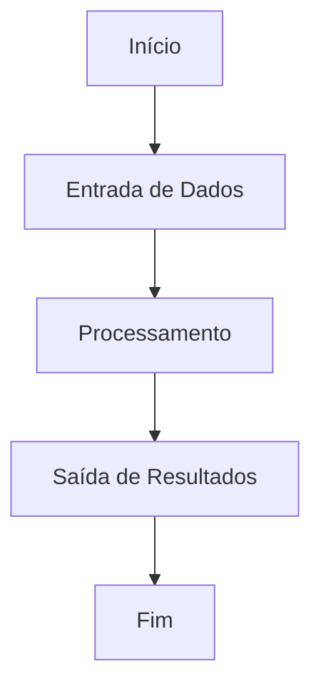
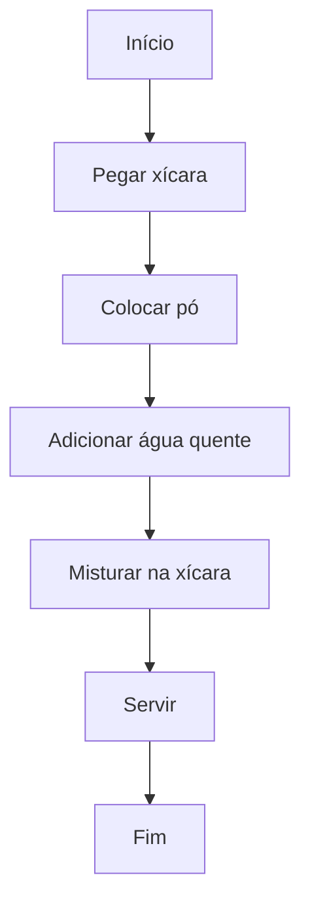
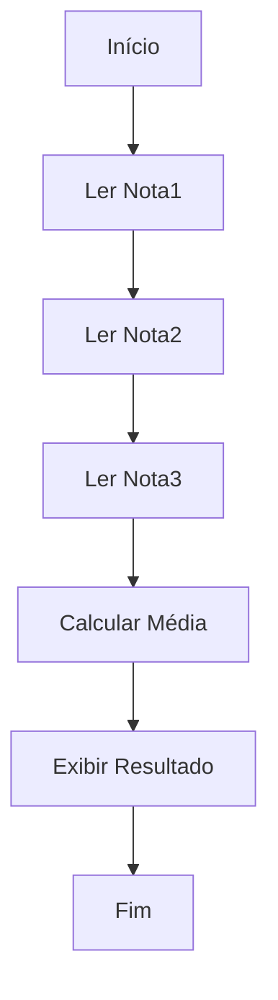
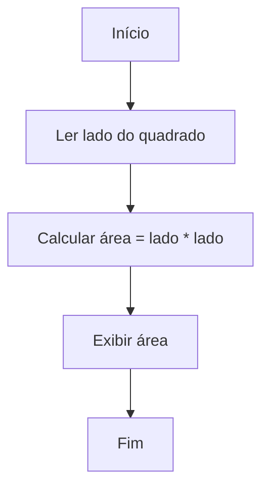

# **Algoritmos e Pensamento Computacional**

---

## **1. Introdução ao Pensamento Computacional**

### 🔍 **O que é um Algoritmo?**  
Sequência finita de instruções (**passos**) para se resolver um Problema.

**Analogia do Café**:  
☕ *Como fazer um café?*  
1. Pegar xícara (✔️)  
2. Colocar pó de café soluvel (✔️)  
3. Adicionar água quente (✔️)  
4. Misturar na xícara (✔️)  
5. Servir (✔️)  

Cada passo é essencial e na ordem correta. Se trocar a ordem (ex: servir antes de misturar), o resultado será diferente.

**Exemplo do Dia a Dia**:  
📌 *Como escovar os dentes*  
1. Pegar a escova e a pasta  (✔️) 
2. Molhar a escova (✔️)  
3. Colocar pasta na escova (quantidade do tamanho de uma ervilha) (✔️)  
4. Escovar por 2 minutos (✔️)  
5. Enxaguar a boca (✔️)  

---

## **2. Componentes Básicos de um Algoritmo**  

### 🖥️ **Partes de um Algoritmo**  
Todo programa tem 3 componentes principais:  

| Ícone | Componente       | Exemplo no Café          | Exemplo em Programação      |  
|-------|------------------|--------------------------|-----------------------------|  
| 📥    | **Entrada**      | Pó de café, água quente  | `input()` do usuário        |  
| ⚙️    | **Processamento**| Misturar ingredientes    | Cálculos (`+`, `-`, `if`)   |  
| 📤    | **Saída**        | Café pronto              | `print()` do resultado      |  

**Exemplo Visual**:  
```
[📥 Pó + Água] → [⚙️ Misturar] → [📤 Café]

```
**Legenda**:  
- **Entrada**: Dados que o programa recebe (ex: números, texto)  
- **Processamento**: Cálculos ou decisões com os dados  
- **Saída**: Resultado exibido ao usuário  

### 📌 **Fluxograma Genérico**  


### 📌 **Fluxograma Fazer Café**  


### 📝 **Pseudoalgoritmo**  
```
1. INÍCIO
2. Pegar xícara vazia
3. Colocar 1 colher de pó de café na xícara
4. Aquecer água até ferver
5. Despejar água quente na xícara
6. Mexer por 10 segundos
7. Servir café pronto
8. FIM
```

---

## **3. Exemplo: Calcular Média de Notas**  

### 🖥️ **Componentes do Algoritmo**:  
```
[📥 Notas] → [⚙️ Calculo da Média] → [📤 Exibir Resultado]
```

### 📝 **Pseudoalgoritmo**  
```
1. INÍCIO
2. Digitar Nota1
3. Digitar Nota2
4. Digitar Nota3
5. Calcular Média = (Nota1 + Nota2 + Nota3) / 3
6. Mostrar "A média é: ", Média
7. FIM
```

### 🔄 **Fluxograma**  

---

## **4. Outros Exemplos Simples**  

### **Exemplo 1: Converter Metros para Centímetros**  
**Pseudoalgoritmo**:  
```
1. INÍCIO  
2. Digitar valor em metros (M)  
3. Calcular CM = M * 100  
4. Mostrar "Centímetros: ", CM  
5. FIM  
```

### **Exemplo 2: Calcular Área do Quadrado**  
**Fluxograma**:  

---

## **5. Linguagens de Programação**  

### **Tipos de Linguagens**  

| Tipo               | Exemplos          | Uso Típico                |  
|--------------------|-------------------|---------------------------|  
| **Linguagens de Alto Nível** | Python, Java, C# | Fácil para humanos, usada em aplicações modernas |  
| **Linguagens de Baixo Nível** | Assembly, C | Mais próxima da máquina, usada em sistemas embarcados |  
| **Linguagens de Script** | JavaScript, Bash | Automatização de tarefas |  

**Analogia**:  
- **Alto Nível**: "Faça um café" (abstrato)  
- **Baixo Nível**: "Mova o braço 30cm para direita, abra a gaveta..." (detalhado)  

**Como Funcionam?**  
1. **Programador** escreve código (texto)  
2. **Compilador/Interpretador** traduz para linguagem de máquina  
3. **Computador** executa as instruções  

---

## **6. Glossário Visual**  

| Ícone | Termo          | Definição                     |  
|-------|----------------|-------------------------------|  
| 📥     | **Entrada**    | Dados fornecidos pelo usuário |  
| ⚙️     | **Processamento** | Operações com os dados       |  
| 📤     | **Saída**      | Resultado do programa         |  
| 🐞     | **Bug**        | Erro no código                |  
| 🔍     | **Depuração**  | Processo de corrigir bugs     |  
| 📝     | **Pseudoalgoritmo** | Algoritmo em linguagem natural |  
| 🔄     | **Fluxograma**      | Diagrama de passos            |  
| 🖥️     | **Linguagem Alto Nível** | Mais próxima do humano     |  
| ⚙️     | **Linguagem Baixo Nível** | Mais próxima da máquina    |  

---

## **7. Analogias para Fixação**

1. **Algoritmo = Receita Culinária**  
   - Ingredientes → Variáveis  
   - Passos → Linhas de código  
   - Forno → Computador  

2. **Bug = Erro na Receita**  
   - Ex: Sal em vez de açúcar → Resultado inesperado  

3. **Depuração = Prova do Bolo**  
   - Testar cada parte antes de servir  

---

## 🎯 **8. Exercícios Propostos**  

### ✏️ **1. Algoritmo para Ligar um Carro**  
Crie um pseudoalgoritmo e fluxograma com os passos necessários.  

### 🧮 **2. Calcular Área de um Retângulo**  
Pseudoalgoritmo que:  
1. Pede largura e altura  
2. Calcula área (largura × altura)  
3. Exibe o resultado  

---

### 📋 **Boas Práticas**  
1. Sempre comece definindo **ENTRADAS** e **SAÍDAS**  
2. Teste seu algoritmo com dados fictícios ("teste de mesa")  
3. Revise a ordem dos passos antes de implementar  


---
## **📋 Material Complementar**

**Ferramentas Visuais**:
- [PythonTutor](https://pythontutor.com/) (visualização passo a passo)
